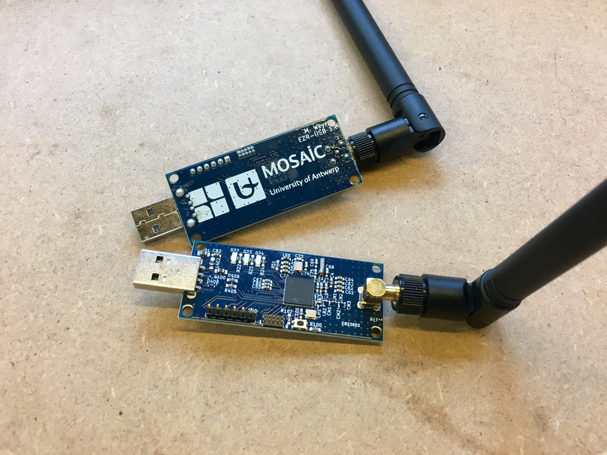

# Welcome

OSS-7 is an open source implementation of the [DASH7 Alliance](http://www.dash7-alliance.org) protocol for ultra low power wireless sensor communication. The aim of the project is to provide a reference implementation of the protocol stack which allows for fast development and prototyping of DASH7 based products. This implementation focusses on completeness, correctness, ease of use and understanding. Performance and code size are less important aspects. For clarity a clear separation between the ISO layers is maintained in the code.

For more information visit the [OSS-7 site](http://mosaic-lopow.github.io/dash7-ap-open-source-stack/) and our [doxygen site](http://mosaic-lopow.github.io/dash7-ap-open-source-stack/doxygen/)

&copy; Copyright 2015-2016, University of Antwerp and others

Licensed under the Apache License, Version 2.0 (the "License"): You may not use these files except in compliance with the License. You may obtain a copy of the License at [http://www.apache.org/licenses/LICENSE-2.0](http://www.apache.org/licenses/LICENSE-2.0)

Unless required by applicable law or agreed to in writing, software distributed under the License is distributed on an "AS IS" BASIS, WITHOUT WARRANTIES OR CONDITIONS OF ANY KIND, either express or implied. See the License for the specific language governing permissions and limitations under the License.

## Getting Started

OSS-7 uses `cmake` to build the demo applications and drivers for the supported platforms. You can use it interactively, as discussed on our [doxygen site](http://mosaic-lopow.github.io/dash7-ap-open-source-stack/doxygen/md_gettingstarted.html). Most of these steps are also combined in a `Makefile`. Overriding only a couple of environment variables allows for a quick compilation of one of the supported applications:

### Default Application: Gateway

```bash
$ cd dash7-ap-open-source-stack/
$ make
*** preparing ../build/gateway
-- Cross-compiling using gcc-arm-embedded toolchain
-- Cross-compiling using gcc-arm-embedded toolchain
-- detected supported platforms: EFM32GG_STK3700 EFM32HG_STK3400 ifest matrix_tp1089
-- selected platform: EFM32GG_STK3700
-- The ASM compiler identification is GNU
-- Found assembler: /Users/xtof/Workspace/UA/projects/gcc-arm-none-eabi-4_9-2015q3/bin/arm-none-eabi-gcc
-- Configuring done
-- Generating done
-- Build files have been written to: /Users/xtof/Workspace/UA/projects/build/gateway
*** building ../build/gateway/apps/gateway/gateway.elf
Scanning dependencies of target CHIP_CC1101
[  1%] Building C object framework/hal/platforms/platform/chips/cc1101/CMakeFiles/CHIP_CC1101.dir/cc1101.c.obj
...
Scanning dependencies of target gateway.elf
[ 98%] Building C object apps/gateway/CMakeFiles/gateway.elf.dir/app.c.obj
[100%] Linking C executable gateway.elf
[100%] Built target gateway.elf
```

### Platforms

As can be seen in the output of the `cmake` build process, several platforms are supported:

```
-- detected supported platforms: EFM32GG_STK3700 EFM32HG_STK3400 ifest matrix_tp1089
```

These platforms can be found in the `stack/framework/hal/platforms` folder. They define and provide access to the available hardware components.

The default platform is `EFM32GG_STK3700`. Specifying a different platform is possible using the `PLATFORM` environment variable:

```bash
$ PLATFORM=EFM32HG_STK3400 make
*** preparing ../build/gateway
-- Cross-compiling using gcc-arm-embedded toolchain
-- Cross-compiling using gcc-arm-embedded toolchain
-- detected supported platforms: EFM32GG_STK3700 EFM32HG_STK3400 ifest matrix_tp1089
-- selected platform: EFM32HG_STK3400
-- The ASM compiler identification is GNU
-- Found assembler: /Users/xtof/Workspace/UA/projects/gcc-arm-none-eabi-4_9-2015q3/bin/arm-none-eabi-gcc
-- Configuring done
-- Generating done
-- Build files have been written to: /Users/xtof/Workspace/UA/projects/build/gateway
*** building ../build/gateway/apps/gateway/gateway.elf
...
Scanning dependencies of target gateway.elf
[ 98%] Building C object apps/gateway/CMakeFiles/gateway.elf.dir/app.c.obj
[100%] Linking C executable gateway.elf
[100%] Built target gateway.elf
```

**A WORD OF CAUTION** - We recently changed our UART, SPI and I2C implementations. Although done with care, things can still go wrong in unexpected ways. Just use the bug reporting facilities to inform us, of help out and submit a pull request. The `EFM32GG_STK3700` is well tested, on the others YMMV.

### Specifying a Different Application

Demo Applications are located in the `stack/apps` folder:

```bash
$ ls stack/apps/
CMakeLists.txt  d7ap_test/      noise_logger/   phy_test/       simple_leds/
continuous_tx/  gateway/        per_test/       radio_ping/     stk3700_sensor/
```

Any of these apps can be selected using tha `APP` environment variable:

```bash
$ APP=per_test make
*** preparing ../build/per_test
-- Cross-compiling using gcc-arm-embedded toolchain
-- Cross-compiling using gcc-arm-embedded toolchain
-- detected supported platforms: EFM32GG_STK3700 EFM32HG_STK3400 ifest matrix_tp1089
-- selected platform: EFM32GG_STK3700
-- The ASM compiler identification is GNU
-- Found assembler: /Users/xtof/Workspace/UA/projects/gcc-arm-none-eabi-4_9-2015q3/bin/arm-none-eabi-gcc
-- Configuring done
-- Generating done
-- Build files have been written to: /Users/xtof/Workspace/UA/projects/build/per_test
*** building ../build/per_test/apps/per_test/per_test.elf
...
Scanning dependencies of target per_test.elf
[ 98%] Building C object apps/per_test/CMakeFiles/per_test.elf.dir/per_test.c.obj
[100%] Linking C executable per_test.elf
[100%] Built target per_test.elf
```

### Introducing `d7ap_test`

One of the first apps you can/should start playing with is `d7ap_test`. Its a very basic app that applies the typical sensor-app pattern. Every 5 seconds it will send out a sensor reading (in this case an increasing counter value). Let's build it using the default platform:

```bash
$ APP=d7ap_test make
*** preparing ../build/d7ap_test
-- Cross-compiling using gcc-arm-embedded toolchain
-- Cross-compiling using gcc-arm-embedded toolchain
-- detected supported platforms: EFM32GG_STK3700 EFM32HG_STK3400 ifest
-- selected platform: EFM32GG_STK3700
-- The ASM compiler identification is GNU
-- Found assembler: /Users/xtof/Workspace/UA/projects/gcc-arm-none-eabi-4_9-2015q3/bin/arm-none-eabi-gcc
-- Configuring done
-- Generating done
-- Build files have been written to: /Users/xtof/Workspace/UA/projects/build/d7ap_test
*** building ../build/d7ap_test/apps/d7ap_test/d7ap_test.elf
...
Scanning dependencies of target d7ap_test.elf
[ 98%] Building C object apps/d7ap_test/CMakeFiles/d7ap_test.elf.dir/d7ap_test.c.obj
[100%] Linking C executable d7ap_test.elf
[100%] Built target d7ap_test.elf
```

The `Makefile` also provides basic support for flashing your device on Giant Gecko-based platforms, using `JLinkExe`. To make sure this approach works for you, just launch `JLinkExe` when you have connected your computer to the Segger programmer and have the device powered. The output should look this:

```bash
$ JLinkExe 
SEGGER J-Link Commander V6.00g (Compiled Aug 17 2016 13:22:19)
DLL version V6.00g, compiled Aug 17 2016 13:22:04

Connecting to J-Link via USB...O.K.
Firmware: J-Link Lite-Cortex-M V8 compiled Aug 20 2015 17:57:19
Hardware version: V8.00
S/N: 518007303
License(s): GDB
VTref = 0.000V


Type "connect" to establish a target connection, '?' for help
J-Link>
```

Take note of your `S/N` serial number. The `Makefile` requires it to identify your programmer (in case you have multiple active at the same time). You can lock it in you `Makefile.local`:

```
PROGRAMMER            = 518007303
```

To flash the program to the device, simply issue `make program`:

```bash
$ APP=d7ap_test make program
*** programming...
SEGGER J-Link Commander V6.00g (Compiled Aug 17 2016 13:22:19)
DLL version V6.00g, compiled Aug 17 2016 13:22:04
...
Comparing flash   [100%] Done.
Erasing flash     [100%] Done.
Programming flash [100%] Done.
Verifying flash   [100%] Done.
J-Link: Flash download: Flash programming performed for 1 range (67584 bytes)
J-Link: Flash download: Total time needed: 1.013s (Prepare: 0.048s, Compare: 0.011s, Erase: 0.173s, Program: 0.770s, Verify: 0.002s, Restore: 0.007s)
O.K.
Loading binary file ../build/d7ap_test/apps/d7ap_test/d7ap_test.bin
Reading 66704 bytes data from target memory @ 0x00000000.
Verify successful.
Reset delay: 0 ms
Reset type NORMAL: Resets core & peripherals via SYSRESETREQ & VECTRESET bit.
```

The operation of the app is pretty much silent, so to be able to see what is happening, we will want to enable the logging of the framework. This can be done using the `FRAMEWORK_LOG_ENABLED` variable for `cmake`, which is also exposed through the `Makefile`:

```bash
$ APP=d7ap_test FRAMEWORK_LOG_ENABLED=yes make clean program
*** preparing ../build/d7ap_test
...
Loading binary file ../build/d7ap_test/apps/d7ap_test/d7ap_test.bin
Reading 51704 bytes data from target memory @ 0x00000000.
Verify successful.
Reset delay: 0 ms
Reset type NORMAL: Resets core & peripherals via SYSRESETREQ & VECTRESET bit.
```

Most of our apps have some sort of `console` functionality. Often this only includes output, like informational logging, sometimes this includes a fully functional command prompt. In this case, the app only provides logging output.

You can connect an FTDI cable to pins `PE0` and `PE1` on your Giant Geck dev board and read the output. You can do this using e.g. `screen`. We also provide an in-repository python-based tool, `scat.py`:


```bash
$ ./tools/scat.py -h
usage: scat.py [-h] [-v] [-b BAUDRATE] [-s SERIAL]

Dumps received bytes from a serial connection to stdout.

optional arguments:
  -h, --help            show this help message and exit
  -v, --verbose         be verbose
  -b BAUDRATE, --baudrate BAUDRATE
                        baudrate
  -s SERIAL, --serial SERIAL
                        serial port to dump
$ ./tools/scat.py -s /dev/tty.usbserial-FTGCT0F9 -b 115200 | head -10

[000] Device booted at time: 0

[001] RESET RADIO
[002] STROBE 0x30 STATUS: 0x1F
[003] STROBE 0x3D STATUS: 0x0F
[004] WRITE BREG 39 Byte(s) @0x00
[005] RF settings:
[006] 	0x29
[007] 	0x2E
```

The framework logging will produce a lot of information. To see the application part we can grep for `requests`:

```bash
$ ./tools/scat.py -s /dev/tty.usbserial-FTGCT0F9 -b 115200 | grep "requests"
[5529] Not all requests acknowledged
[5834] Not all requests acknowledged
[6139] Not all requests acknowledged
^C
```

This means that there is no other device acknowledging our requests/packets. So if we now introduce a second device with `d7ap_test`, this should change things. Perform the same procedure on a second dev kit, boot both devices and observe the output again:

```bash
$ ./tools/scat.py -s /dev/tty.usbserial-FTGCT0F9 -b 115200 | grep "requests"
[855] Not all requests acknowledged
[418] All requests acknowledged
[523] Not all requests acknowledged
[504] Not all requests acknowledged
[839] All requests acknowledged
^C
```

Although still not all, we now see that the second device acknowledges requests, showing the interaction between both devices. Your first Dash7 network is up and running!

### Trying the EZR-USB platform

A recent addition to the supported platforms is the EZR-USB dongle platform. It is developed by the MOSAIC team as an easy to deploy and use solution to apply Dash7 in various situations.



To program it with the `d7ap_test` application, just add these overrides to your `Makefile.local` (or pass them on the command line just before `make clean all program`):

```
APP                   = d7ap_test
PLATFORM              = EZR32LG_USB01
PLATFORM_USE_USB_CDC  = yes
FRAMEWORK_LOG_ENABLED = yes
```

Program two and plug them into a USB port and notice a new serial device popping up. You can connect to it and read it, like before using `scat.py`:

```
$ ./tools/scat.py -s /dev/tty.usbmodemFD121 -b 115200
[000] Device booted at time: 0
d7ap_t73b2f3?b?(!+P(2 
                      W	? @
[001] Unsol resp -33 dBm, LB 43 dB
?b?(",P%2 
          W	? @
[002] Unsol resp -34 dBm, LB 44 dB
?b?(",P?2 
          W	? @
...
```

The two dongles will notice each others' messages, which they didn't expect and report them as unsolicited received messages.
 